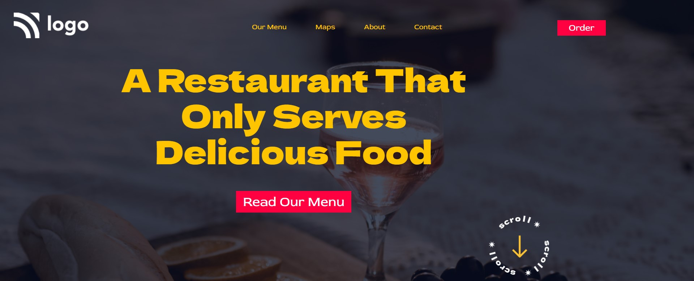

# Assignment 2

 

---

## Project 2 [Live link]()
- Skills Gained in this project
    - Learned css postions.
    - Learned about background image and positioning.
---

## Time taken to finish this project

- 2.5 hour taken to Finish this project.

Screenshot

